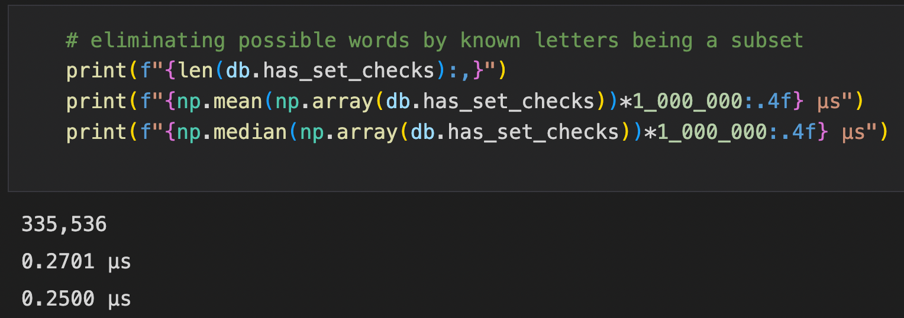

# Wordsmith

## Problem

The popular game Wordle (New York Times) is a word puzzle designed to find a hidden word. An optimal starting strategy is a set of words such that the number of possible hidden words is minimized.

## Strategy Space

The word bank in `data/` contains 15,918 5-letter words. If a 3 word starting strategy is considered the possible strategies are C(15,918, 3) ~= 672B.

The python package (wordsmith) provides code to evaluate a strategy by comparing the distribution of remaining possibilities over a sample of hidden words for a strategy (i.e.how well a set of guesses narrows down the possible hidden words).

This empirically driven evaluation method makes it infeasible to reasonably calculate/parse the entire ~672B combinations. The following assumption is made to reduce the search space: an optimal strategy will contain only unique letters across the words.

To even evaluate the letter-uniqueness of a set of words can be quite cumbersome to compute for this many possible combinations. Therefore, Go is used for its fast computing and multithreading to parse through a sample of combinations. 

The Go program `candidate_filtering` parses the approximately 10,000 words with a set of distinct letters down to a sample of 1,000 words in which all combinations of 3 can be chosen (C(1,000, 3) ~= 116M). These combinations are filtered down to sets with a Jaccard similarity of 0 resulting in finally a more reasonable 215K strategies to be evaluated.

## Evaluation

Evaluation of a strategy (a set of words) is defined by the strategy's filtering of of possible words. An example:

```python
db = WordDatabase("../data/words.txt")
strat = ["leaks", "dumby", "wrong"]

words_left = []
for word in db.words:
    game = Game(word)
    info = game.generate_information(strat)
    words_left.append(len(db.query(info)))
```

This evaluation produces `words_left` and taking a summary statistic like mean or median this strategy can be judged against other strategies. In this case, `["leaks", "dumby", "wrong"]` on average leaves `9.06` possibilities and the median possible words left is `4`.

## Optimization of Strategy Evaluation

This evaluation of a strategy against the database of words is an expensive operation. In the example above, `%%timeit` shows:

<!--  -->


For 215K possible strategies at approx. 10s a strategy, the compute time would be ~600 hours. Using multiple cores or a cluster will lead to linear scaling for this problem. While this is possible for a large cluster to compute in a reasonable time, optimizing single threaded performance and sub-sampling the problem space can produce meaningful results for feasible time and compute.

Querying consists of determining the possible words left given an `Information` object. The _information_ at any point in a Wordle game can be characterized by 4 sets: letters in `hidden_word`, letters not in `hidden_word`, letters in known position of `hidden_word`, and letters not in a position of `hidden_word`. Testing a word against these 4 criteria determines if a word is eligible. Profiling how expensive each operation is results in:

<!-- 


 -->


From this a simple optimal ordering of checks and early termination leads to speed up of:

<!--  -->


A simple Cython implementation leads to farther speed up of:

<!--  -->


To push it even farther a Rust implementation was written as well in `rust_impl` and resulted in ~2x speed up from the Cython above:

<!--  -->


## Results

A random search of a subset of the strategy space with `experiments/run.py` is done by: evaluating 1,000 3-word strategies from the `data/candidates.txt` against 1,000 random hidden words.

The following are optimal strategies starting strategies:

<!--  -->
